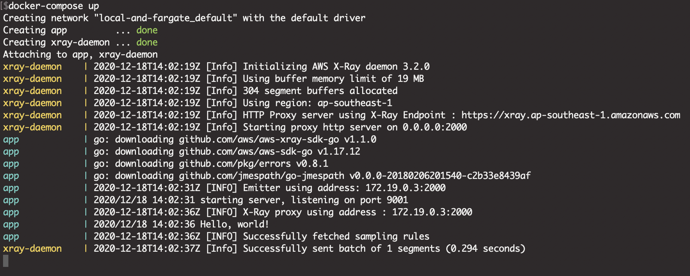
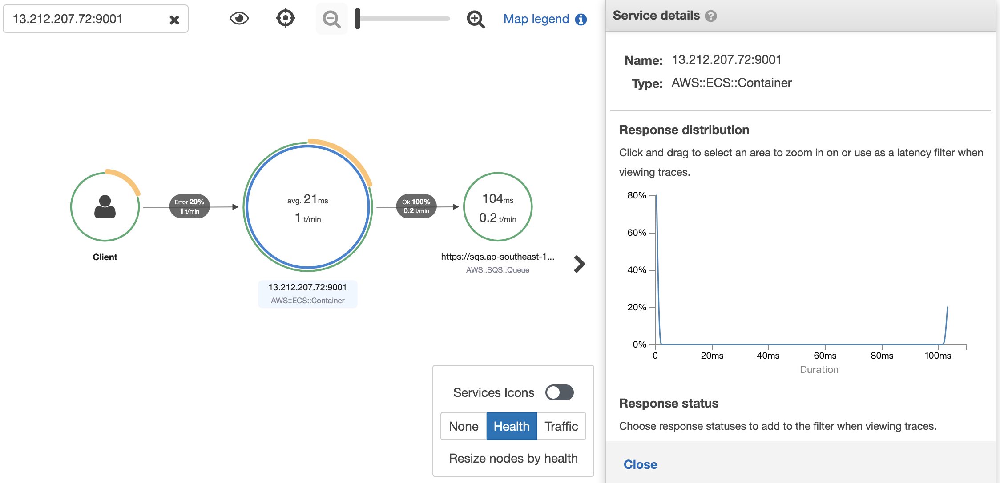

# readme
```bash
.
├── app/                        <-- golang app, restful api with `aws-xray-sdk-go`
├── xray/                       <-- xray Dockerfile, localhost log
├── docker-compose.yml          <-- localhost build Sample Applications
├── Makefile                    <-- docker push app/xray to ECR
└── cfn.yml                     <-- AWS CloudFormation Template
```

# pre-required
- Local AWS Credential

# run localhost
- run 
    1. `docker-compose up`
    2. `curl localhost:9001`




- go to aws xray service to see the information (wait 1 min)



# deploy to ecs-fargate, steps

1. go to ECR and create two repositories
    - xray-app
    - xray-mariadb
    - aws-xray-daemon
2. edit Makefile, to update the below args
    - AWS_ACCOUNT_ID
    - AWS_REGION
3. push image to ECR
    - `make app`
    - `make xray`
    - `make mysql`
4. go to AWS CloudFormation and build stack with `cfn.yml`
5. go to ECS console and get Task public IP, `curl $IP` and then check XRAY console


# xray data generated
- Localhost test, use `make test` to execute below command

## base
- `curl localhost:9001`
- `curl localhost:9001/ping`
## apis with database 
- `curl -X POST localhost:9001/new`
- `curl -X GET localhost:9001/all`
- `curl -X DELETE localhost:9001/del -d '{"id":1}'`
## err
- `curl -X GET localhost:9001/error/400`
- `curl -X GET localhost:9001/error/429`
- `curl -X GET localhost:9001/error/500`
- `curl -X GET localhost:9001/error/panic`
## many funcs
- `curl -X PATCH localhost:9001/many/funcs`
- `curl -X PATCH localhost:9001/send/sqs`